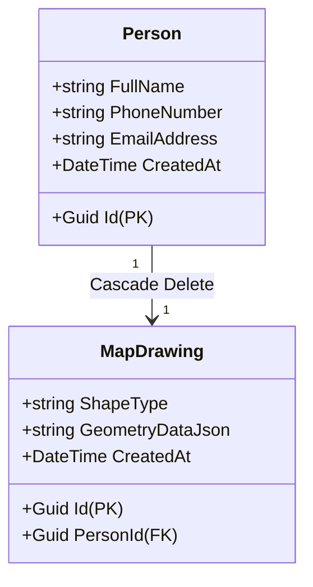

# Person Registration & Map Drawing Application

A production-grade, full-stack web application that allows users to register individuals and draw custom geometric areas (polygons, rectangles, or circles) on an interactive Google Map. The system saves the user information and serializes shape coordinates in a normalized SQLite database.

Built as an entry-to-mid-level .NET assessment, demonstrating clean coding practices, separation of concerns, global exception handling, secure API contracts, and concurrent file-rolling logging.

---

## 🌟 Key Features

### Frontend (React + Tailwind CSS v4)
*   **Responsive Form Validation:** Validates full name, phone number format, and email address using both HTML5 patterns and API-side feedback.
*   **Google Maps Drawing Manager:** Implements interactive drawing tools allowing users to create:
    *   `Polygons` (custom coordinate paths)
    *   `Rectangles` (North-East / South-West bounds)
    *   `Circles` (Center coordinate + radius)
*   **Interactive Toast Alerts:** Custom glassmorphic success and error notifications (success, error, info) with slide-in animations and automatic countdown dismissal.
*   **Network & State Resilience:** Displays loading indicators and "Connection Failed" screens with a **Retry** button when the backend API is unreachable.
*   **API Key Fallback:** Displays a user-friendly configuration warning overlay if the Google Maps API Key is not set, preventing client-side crashes.

### Backend (ASP.NET Core / .NET 10)
*   **Normalized Database Schema:** Decouples user data from drawing metadata by splitting storage into two related tables: `Persons` and `MapDrawings`.
*   **Service Layer Separation:** Thin API Controller delegating database and validation logic to a service layer (`IPersonService` / `PersonService`).
*   **GUID Identifiers:** Swapped standard integer IDs for globally unique identifiers (`Guid`) for both primary and foreign keys.
*   **Global Exception Handling:** Implements `IExceptionHandler` middleware to securely capture and log unexpected exceptions, returning standardized `ProblemDetails` JSON schemas without exposing sensitive database or server details.
*   **Typed Exception Mapping:** Maps specific errors to standard HTTP status codes:
    *   `DuplicateEmailException` $\rightarrow$ `409 Conflict` (checks unique email registrations)
    *   `EntityNotFoundException` $\rightarrow$ `404 Not Found` (handles missing IDs)
    *   `ArgumentException` $\rightarrow$ `400 Bad Request` (covers validation boundaries)
*   **Concurrent Logging:** Integrates `Serilog` to output clean, structured logs to the terminal console while simultaneously writing daily rolling log files under a `/Logs` directory.

---

## 🛠️ Technology Stack

| Layer | Technology | Purpose |
| :--- | :--- | :--- |
| **Frontend** | React 19 / Vite | Dynamic single-page client interface |
| **Styling** | Tailwind CSS v4 | Curated dark mode styling (Stone + Olive palette) |
| **Grid** | AG Grid Community | Pagination and browsing directory |
| **Maps** | @vis.gl/react-google-maps | React wrapper for Google Maps API |
| **Backend** | ASP.NET Core API (.NET 10.0) | High-performance HTTP REST endpoints |
| **ORM** | Entity Framework Core | Database migrations and mapping queries |
| **Database** | SQLite | Lightweight, serverless local database store |
| **Logging** | Serilog.AspNetCore | Dual-sink console and rolling file logs |

---

## 🗄️ Database Architecture

The application uses Entity Framework Core (Code-First) to automatically initialize a normalized, relational SQLite database file (`project-db`) in the root `/database` folder.



---

## ⚙️ Setup & Configuration

### Prerequisites
Make sure you have the following installed on your machine:
*   [Bun](https://bun.sh/) (Recommended) or [Node.js (v18+)](https://nodejs.org/)
*   [.NET 10 SDK](https://dotnet.microsoft.com/download/dotnet/10.0)
*   [Docker Desktop](https://www.docker.com/products/docker-desktop/) (Optional for container running)

### Configuration Settings
1.  **Google Maps API:** Add your API Key inside the `MAPS_API_KEY` variable in [frontend/src/map.jsx](file:///home/admin/prgms/project-app/frontend/src/map.jsx):
    ```javascript
    const MAPS_API_KEY = "YOUR_GOOGLE_MAPS_API_KEY";
    ```
2.  **Database Path:** SQLite paths are configured in [backend/appsettings.json](file:///home/admin/prgms/project-app/backend/appsettings.json) (`Data Source=../database/project-db`).

---

## 🚀 Running the Application

### Method A: Running Locally (Recommended)

1.  **Restore and Run the Backend:**
    ```bash
    cd backend
    dotnet restore
    dotnet run
    ```
    *   The API will listen on `http://localhost:5000` (and `https://localhost:5001`).
    *   The database and schema tables are automatically created on first startup.

2.  **Build and Run the Frontend:**
    From another terminal:
    ```bash
    cd frontend
    bun install   # or npm install
    bun run dev   # or npm run dev
    ```
    *   Open `http://localhost:5173` in your web browser.

---

### Method B: Running with Docker Compose

Ensure Docker is running, then run the following command from the root directory:
```bash
docker compose up --build -d
```
*   **Frontend:** Serves on `http://localhost:3000` (via Nginx).
*   **Backend API:** Exposes endpoints at `http://localhost:5000/api/person`.
*   **Persistence:** Registration data is saved in a persistent Docker volume named `sqlite-data`.

To stop the containers:
```bash
docker compose down
```

---

## 📄 API Contracts

| Method | Endpoint | Description | Payload Structure | Expected HTTP Status |
| :--- | :--- | :--- | :--- | :--- |
| **GET** | `/api/person` | Retrieve all registered users and drawings | None | `200 OK` |
| **GET** | `/api/person/{id}` | Retrieve details for a specific user ID | None | `200 OK` / `404 Not Found` |
| **POST** | `/api/person` | Register a new person and shape | Flat DTO containing user & shape properties | `200 OK` / `409 Conflict` / `400 Bad Request` |
| **PUT** | `/api/person/{id}` | Edit an existing person and map coordinates | Flat DTO containing updated properties | `200 OK` / `409 Conflict` / `404 Not Found` |

---

## 🧠 Technical Assumptions & Decoupling

1.  **UI Contract Decoupling:** Database normalization split data into related tables (`Persons` and `MapDrawings`). To avoid breaking the existing React client, the backend projects queries directly to `PersonResponseDto`, preserving a flat API model.
2.  **Model Validation:** Client inputs are pre-validated dynamically using regular expressions for names, phone numbers, and emails. They are checked again server-side using DataAnnotations before processing.
3.  **Conflict Checks:** Email address duplication is verified before writes. If a conflict occurs, a custom exception (`DuplicateEmailException`) is thrown and translated by the middleware to a clean `409 Conflict` message.

---

## ⏱️ Development Metrics

*   **Estimated Assessment Duration:** ~4 Hours
*   **Actual Development Time:** ~3.5 Hours (including database normalization, service layering, toast UX improvements, file logging, and Docker configs)
*   **Status:** 100% Complete, builds successfully, fully operational locally and in containerized states.
